### 前提
这是一篇最近尝试使用 AWS 的 12 个月免费额度以内的 EC2 部署 Node.js 项目的实践。第一次接触服务器和线上环境部署，遇到了不少问题，很多地方都是一通 Google 之后胡乱操作出结果的。方法估计也不是最好用的，写文章主要是给自己一个总结和分享，建议可以看文末那几篇写得比我清楚很多的文章。部署 Node.js 项目还有很多其他更好的方案，比如 Digital Ocean 的 $5 一月的 VPS，新浪云的更简单的部署也可以参考之前写的[文章](http://oxxd.github.io/nodejs-sinacloud)。还有 Heroku 好像也是一个不错的解决方案，以后尝试之后再总结吧。  
AWS 的 [12 月免费套餐](https://aws.amazon.com/cn/free/)提供相当多的服务，包括最主要用到的 EC2(服务器), RDS(关系型数据库), 是一个用来搭建小型网站的很好的解决方案。详细可以参考[这里](https://aws.amazon.com/cn/free/faqs/?ft=nf&refid=ha_a131L000005CqVRQA0)  
本来我以为 [Elastic Beanstalk](https://aws.amazon.com/cn/getting-started/tutorials/launch-an-app/) 也是包含在免费套餐里的，但是写这篇文章的时候发现并不是 XD。不然使用 Elastic Beanstalk 一键部署项目应该是更简单的选择。我也尝试过使用 Elastic Beanstalk 部署，但是代码上传完毕之后报错找不到 package.json 就不了了之了。  
另外说一下 AWS 的收费机制是账单制度，也就是每个月底会根据你的使用量来进行收费，所以要注意自己的服务用量，以避免额外收费。有可能产生额外收费的地方我稍后会总结在文末。

### 申请 AWS 账号
首先申请 AWS 账号需要提供信用卡，不确定是否需要双币信用卡。信用卡是为了验证用户信息以及后续产生的费用收费的。确认没问题之后可以在这里跟着向导进行[注册](https://aws.amazon.com/cn/free/)，期间会收到英文电话提示输入验证码，信用卡验证会扣一笔 1 美元的扣款，理论上是为了验证卡片，后续会退回。  
然后注意一下自己的注册区域，AWS 中国应该是最近两年才登陆国内的。我的账号似乎因为之前在美区注册过，注册了之后不能选择在国内区域建立主机。

### 创建 EC2 实例
<figure class="half">
    <a href="../images/nodejs-aws-tk.png">
        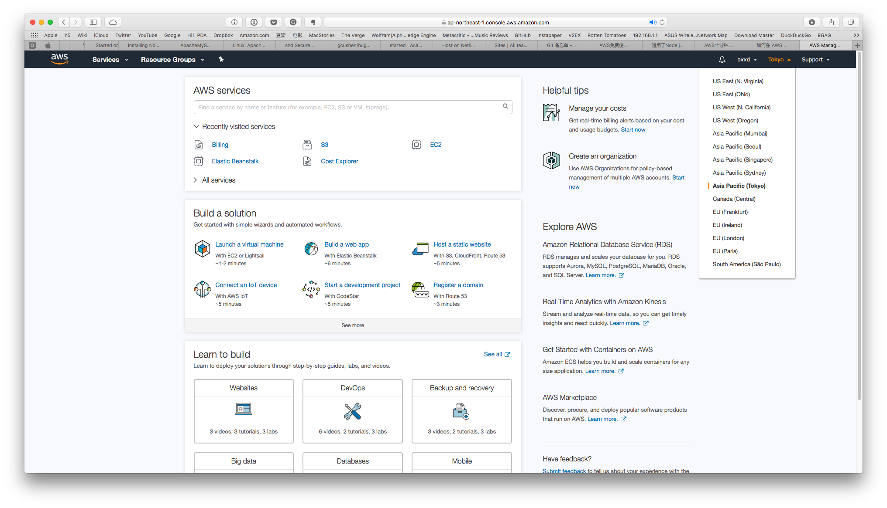
    </a>
    <a href="../images/nodejs-aws-ec2.png">
        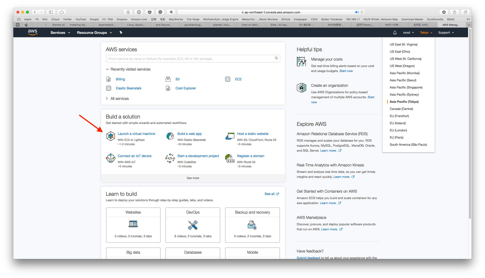
    </a>
	<figcaption><span>创建 EC2 实例</span>.</figcaption>
</figure>
登入控制台，准备创建 EC2 实例之前先确认一下所在区域。我这里选择的是 Tokyo 的，因为之前在美国的一个主机 SSH 登录不上去，不确定是什么原因。如果是国内账号应该能选择北京或者宁夏区域。

<figure class="third">
	<a href="../images/nodejs-aws01.png">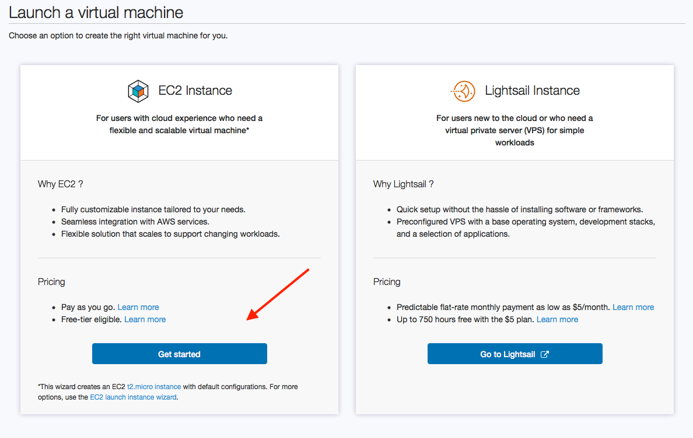</a>
	<a href="../images/nodejs-aws02.png">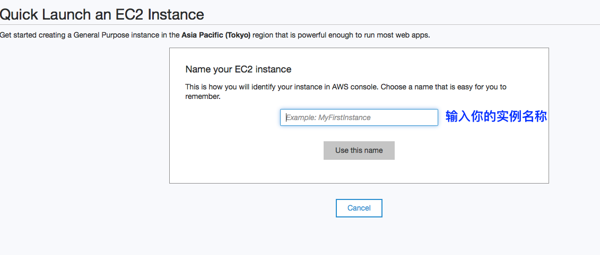</a>
	<a href="../images/nodejs-aws03.png">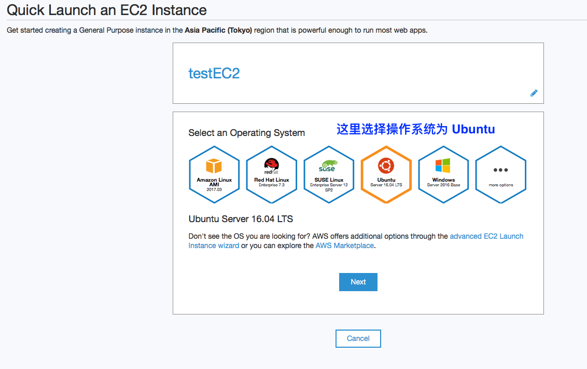</a>
	<a href="../images/nodejs-aws04.png">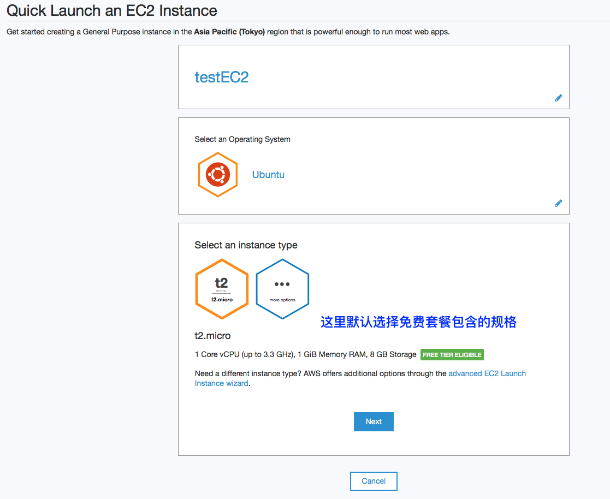</a>
	<a href="../images/nodejs-aws05.png">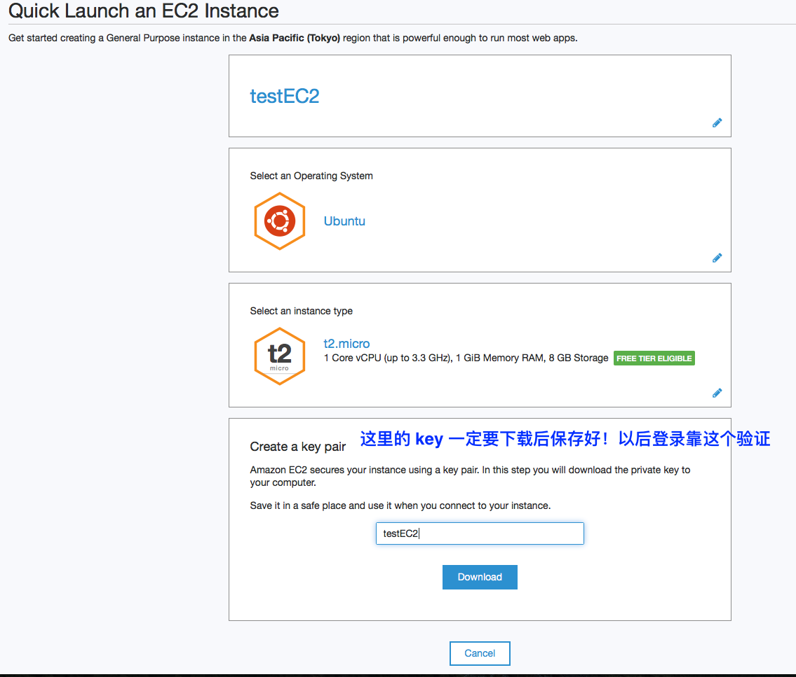</a>
	<a href="../images/nodejs-aws06.png">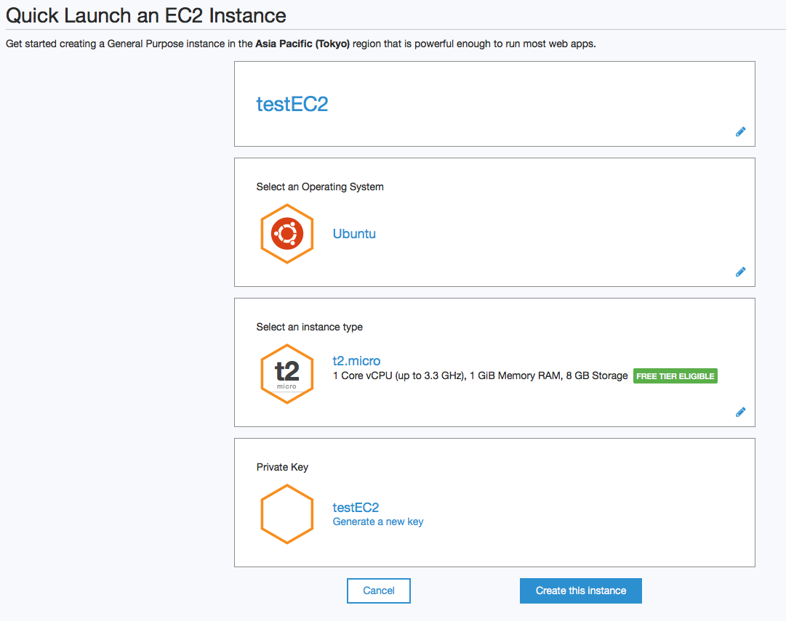</a>
	<figcaption>创建 EC2 实例步骤</figcaption>
</figure>
创建 EC2 实例步骤  跟着向导一步步向下就可以了，这里我选择的服务器是 Ubuntu 的，Ubuntu 系统默认用户名是 ubuntu 一会儿会用到。

### 为 EC2 配置入站端口
创建好之后首先要配置一下入站规则，让服务器允许 HTTP 端口。步骤以下。
<figure class="half">
    <a href="../images/nodejs-aws10.png">
        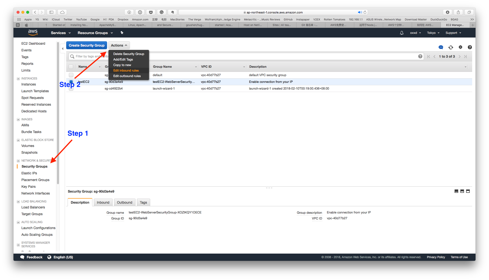
    </a>
    <a href="../images/nodejs-aws11.png">
        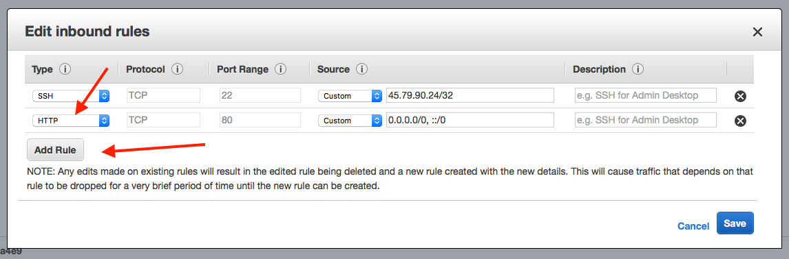
    </a>
	<figcaption><span>配置入站端口</span>.</figcaption>
</figure>
1. 前往 EC2 控制台。选择 Secruity Groups，选中刚刚创建的实例所用的规则，点击 Action，点击 Edit inbound rules(编辑入站规则)。
2. 点击 Add Rule，在类型下拉框中选择 HTTP，默认会在端口处为你填上 80 端口。
3. 添加自定义端口也是一样的步骤。类型中选择 Custom 就可以了。

### 连接 EC2 实例
接下来是连接 EC2 实例。这一步是比较重要的，毕竟连接上了才能做后续操作。打开终端开始输入命令吧。
<figure>
    <a href="../images/nodejs-aws08.png">
        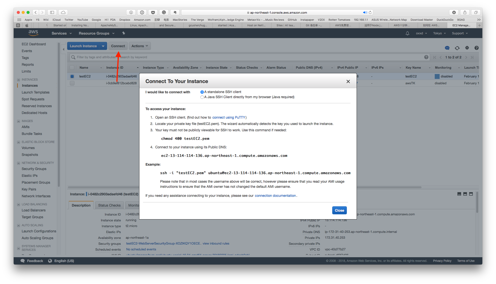
    </a>
	<figcaption><span>连接 EC2 实例</span>.</figcaption>
</figure>
``` bash
# 首先使用 chmod 命令来确保您的私有密钥文件不是公开可见的，
chmod 400 testEC2.pem 
# 连接。注意 @ 后面换成自己的实例 DNS 地址或者 IP 地址
ssh -i "testEC2.pem" ubuntu@ec2-198-51-100-1.compute-1.amazonaws.com
```

### 安装 Node.js
连接上之后就可以开始安装 Node.js 等我们需要的服务啦。这些全都是在命令行内操作的，安装方法也还有其他很多。[参考](https://nodejs.org/en/download/package-manager/#debian-and-ubuntu-based-linux-distributions)

``` bash
curl -sL https://deb.nodesource.com/setup_8.x | sudo -E bash -
sudo apt-get install -y nodejs
```

检查是否安装成功
``` bash
node -v
```

### 安装 Apache + PHP + MySQL
虽然我们不需要用到 Apache，但是我们需要在本地安装 MySQL。数据库服务也可以选择 AWS 提供的 RDS 更加方便。但是我创建的 RDS 实例连不上，所以就直接在服务器上搭数据库了。
这里直接安装 LAMP, [参考](https://help.ubuntu.com/community/ApacheMySQLPHP)。
``` bash 
# 检查更新
sudo apt-get update
# 安装 LAMP
sudo apt-get install lamp-server^
```

也可以分开安装，具体就不详述了。如果需要 phpmyadmin, [参考](https://www.digitalocean.com/community/tutorials/how-to-install-and-secure-phpmyadmin-on-ubuntu-12-04)
``` bash
# 安装 phpmyadmin
sudo apt-get install phpmyadmin apache2-utils
```

连接数据库验证一下安装是否成功
``` bash
mysql -u root -p
```
验证 Apach 是否安装成功直接打开 EC2 DNS地址就可以了，看到页面就说明 Apache 启动成功。如果没有看到页面，可以尝试重启 EC2 实例。  

这里因为不需要 Apach 并且想偷懒直接把 Node 运行在 80 端口，所以把 Apache 禁用了
``` bash
 sudo systemctl stop apache2.service.
```

### 部署
我这里部署是直接从 Github 上把自己项目 clone 下来的，这是最方便的方式了。  
``` bash
git clone https://github.com/yourapp.git
cd yourapp

# 执行 screen 保持 node 一直在跑。 SSH 连接过几分钟没有操作是会自动断开的
screen
# 因为 app.js 中设置了端口号为 80 所以需要 sudo 权限启动应用，否则不需要
sudo node app.js
```
打开 EC2 DNS地址访问是否能够看到页面。

### 绑定 Elastic IP 以及自定义域名
如果不想用系统分配的一长串的 DNS 地址或者 IP 地址来访问网站的话就需要自定义域名啦。下面说一下如何给 EC2 分配静态 IP 并且绑定自定义域名。
<figure class="half">
    <a href="../images/nodejs-aws13.png">
        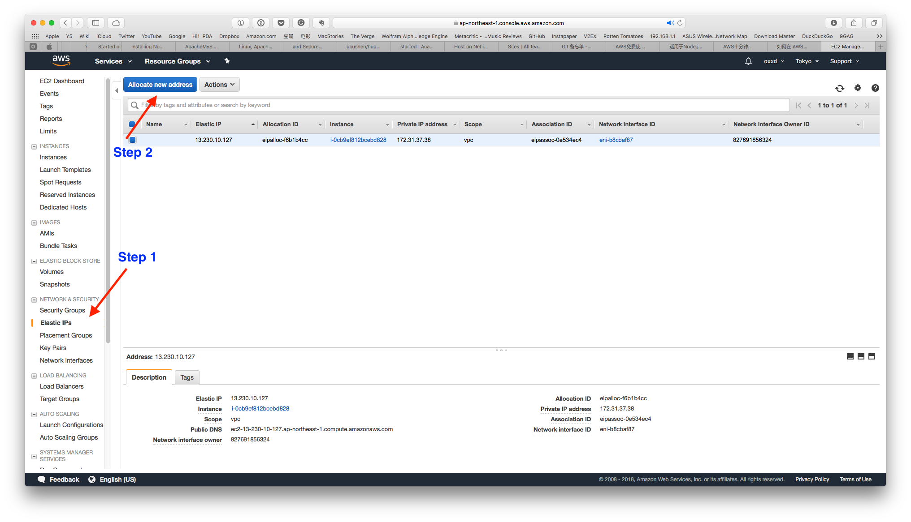
    </a>
    <a href="../images/nodejs-aws16.png">
        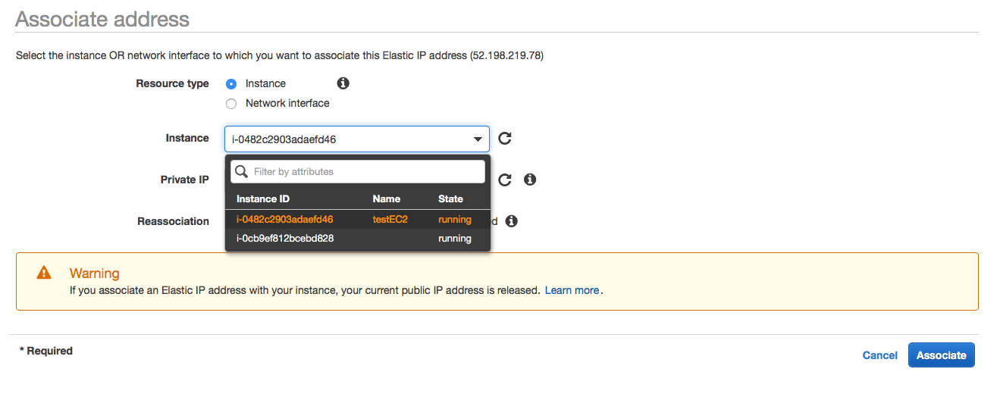
    </a>
	<figcaption><span>给 EC2 实例分配静态 IP</span>.</figcaption>
</figure>
为了要给 EC2 实例帮顶自定义域名首先要使用 Elastic IP 给他分配静态 IP 地址。注意 AWS 规定创建了一个静态 IP 地址如果没有绑定实例是会按小时收费的。  
点击 Elastic IP，点击 Allocate new address, 在弹出的窗口中将 EC2 实例(Instance)分配给这个地址。 
<figure>
    <a href="../images/nodejs-aws17.png">
        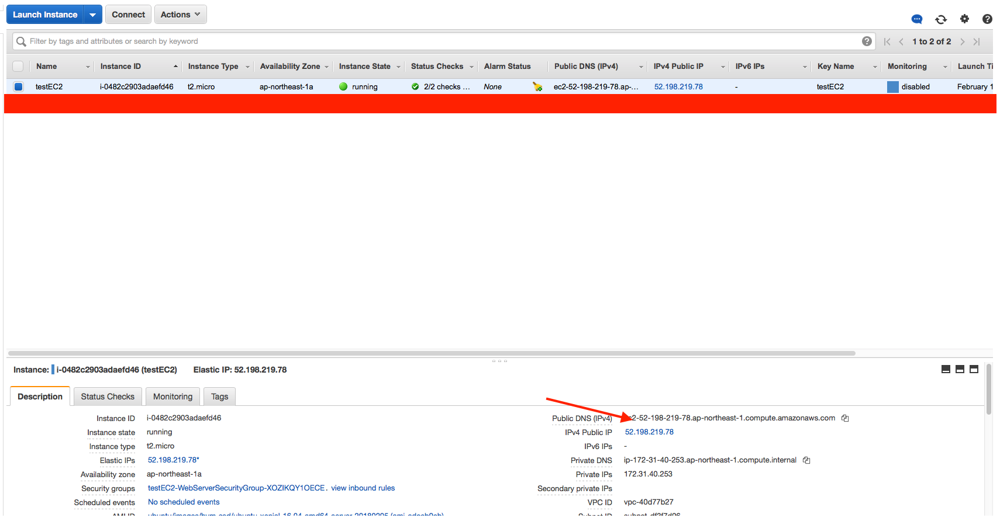
    </a>
	<figcaption><span>回到 EC2 控制台可以看到实例地址也做了改变。</span>.</figcaption>
</figure>

#### 到自己的域名注册商中解析域名

### 填坑


### 参考文档
* [在Amazon EC2 上部署node.js应用](http://ned11.iteye.com/blog/1775898)
* [筆記｜在AWS EC2部署Node.js web教學](http://dez.logdown.com/posts/2017/04/07/aws-ec2-deploy-nodejs-web-app)
* [小白如何利用wordpress和aws从零搭建自己的个人网站](http://www.yours1989.com/52/)
* [在 Amazon AWS 搭建及部署网站：（一）申请、设置 AWS 服务](http://www.cnblogs.com/deltacat/p/amazon-aws-web-1.html)
* [Installing Node.js via package manager](https://nodejs.org/en/download/package-manager/#debian-and-ubuntu-based-linux-distributions)
* [To install the default LAMP stack in Ubuntu 10.04 and above](https://help.ubuntu.com/community/ApacheMySQLPHP)
* [How To Install Linux, Apache, MySQL, PHP (LAMP) stack on Ubuntu 16.04](https://www.digitalocean.com/community/tutorials/how-to-install-linux-apache-mysql-php-lamp-stack-on-ubuntu-16-04)
* [How To Install and Secure phpMyAdmin on Ubuntu 12.04](https://www.digitalocean.com/community/tutorials/how-to-install-and-secure-phpmyadmin-on-ubuntu-12-04)
* [AWS 免费套餐](https://aws.amazon.com/cn/free/)
* [AWS 10 分钟教程](https://aws.amazon.com/cn/getting-started/tutorials/)
* [通过 Amazon EC2启动 Linux 虚拟机](https://aws.amazon.com/cn/getting-started/tutorials/launch-a-virtual-machine/)
* [通过 AWS Elastic Beanstalk启动应用程序](https://aws.amazon.com/cn/getting-started/tutorials/launch-an-app/)