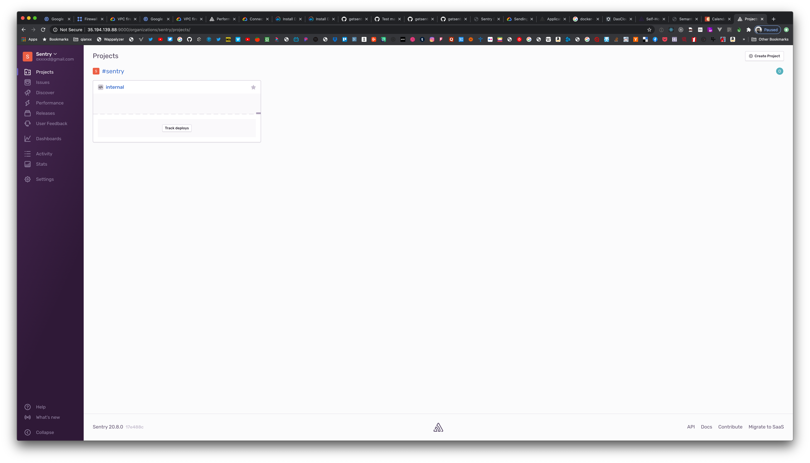

## 前提

项目上线之后，线上问题尤其是线上报错导致的页面无法正常渲染是非常严重的问题。一个异常监控服务可以及时报警通知、提供有效信息和报错堆栈等排查问题。调研了部分异常监控服务以及自研成本之后，决定选择自行搭建 [Sentry](https://sentry.io/welcome/) 这款异常监控服务。`Sentry` 提供 `SaaS 服务`也提供自行搭建部署，并且搭建部署也是非常简单方便，在功能使用上面也非常全面易用、支持多平台。

市面上也还有其他优秀的异常监控服务 [阿里云 ARMS](https://help.aliyun.com/document_detail/58652.html?spm=a2c4g.11174283.3.2.4316668c4gv6Cg), [岳鹰](https://yueying.effirst.com/index), [腾讯 Badjs](http://betterjs.github.io), [Fundebug](https://github.com/Fundebug), [FrontJS](https://www.frontjs.com) 等等等等

## 准备

1. 一台服务器，由于运行了 `kafka`, `zookeeper` 等等服务并且如果后续接入业务流量较大还是需要一定配置，建议服务器规格至少 `4G` 内存，条件运行可以 `8G` 内存，官方文档中说明至少需要 `2400MB RAM` 。这里使用的是 [Google Cloud](https://cloud.google.com) 上的 `n1-standard-1 (1 vCPU, 3.75 GB memory)` 搭配 `CentOS 7` 演示，在公司内部搭建的是阿里云的服务器。
2. 一个可以提供 `smtp` 端口发邮件的邮箱，由于用户注册、报警通知等都会通过发送邮件所以邮箱还是近乎必须的
3. 部分 `git`, `shell`, `docker` 的知识

## Docker

`Sentry On-Premise` 的安装脚本使用 `Docker` 和 `Docker Compose`, 可以很方便的搭建起来。所以我们先在服务器上搭建 `Docker`

以下命令都在 `root` 用户下操作，这里先切换成超级用户

```bash
sudo -i
```

参考[ Docker 文档](https://docs.docker.com/engine/install/centos/)安装 docker，如果需要安装特定版本或者不同操作系统，官方文档都提供了不同的安装方法可以参考阅读

```bash
# 安装 yum-utils
yum install -y yum-utils

# 添加 docker 官方仓库
yum-config-manager \
  --add-repo \
  https://download.docker.com/linux/centos/docker-ce.repo

# 安装最新版的 docker
yum install docker-ce docker-ce-cli containerd.io

# 启动 docker
systemctl start docker

# 测试 docker 是否安装成功
docker run hello-world
```

还需要 `docker-compose` 所以也参考[官方文档](https://docs.docker.com/compose/install/)安装，如果国内服务器连接 `Github` 速度较慢可以使用一些国内的[镜像](https://get.daocloud.io/)

```bash
# 从 github 上下载 docker-compose
curl -L "https://github.com/docker/compose/releases/download/1.26.2/docker-compose-$(uname -s)-$(uname -m)" -o /usr/local/bin/docker-compose

# 使 docker-compose 可执行
chmod +x /usr/local/bin/docker-compose

# 添加软链方便使用
ln -s /usr/local/bin/docker-compose /usr/bin/docker-compose

# 运行下确认版本及安装成功
docker-compose --version
```

## 部署 Sentry

安装 `Git` 来克隆项目

```bash
yum install git
```

克隆项目，切换到对应版本分支，`master` 分支为开发分支并不稳定建议切换为对应版本分支，自从 `10.0.x` 之后 `Sentry` 的版本规则从 [SemVer](https://semver.org/) [切换](https://blog.sentry.io/2020/06/22/self-hosted-sentry-switching-to-calver/)到了 [CalVer](https://calver.org/)

```bash
mkdir /home/admin
cd /home/admin
git clone https://github.com/getsentry/onpremise.git
cd onpremise
git checkout releases/20.0.8
```

克隆完项目之后，我们需要修改一些配置再执行安装脚本，比如配置发送邮件的邮箱，配置额外的插件（如钉钉推送等）

下面是克隆下来的项目目录

```text
├── .craft.yml
├── .env # 环境参数
├── .gitignore
├── .travis.yml
├── LICENSE
├── README.md
├── cron
│   ├── Dockerfile
│   └── entrypoint.sh
├── docker-compose.yml # docker-compose 文件
├── install.sh # 安装脚本
├── nginx # nginx 配置
│   └── nginx.conf
├── relay
│   └── config.example.yml
├── scripts
│   └── bump-version.sh
├── sentry # sentry 的自定义配置，如邮箱配置、额外插件等等
│   ├── .dockerignore
│   ├── Dockerfile
│   ├── config.example.yml
│   ├── requirements.example.txt
│   └── sentry.conf.example.py
├── symbolicator
│   └── config.example.yml
├── test.sh
└── zookeeper
    └── snapshot.0
```

复制一份 `config.example.yml` 为 `config.yml` 修改邮箱配置

```bash
cp sentry/config.example.yml sentry/config.yml
```

如果你的服务器支持 `25` 端口的邮箱发送，并且不打算使用加密协议 `TLS` 或者 `SSL` 发送邮件可以直接修改下面相应的配置 `25` 端口即可。这里使用的是阿里云的邮箱，也可以使用其他任意邮箱服务提供商。

`sentry/config.yml`

```yml
#mail.backend: "smtp" # Use dummy if you want to disable email entirely
mail.host: "smtp.aliyun.com"
mail.port: 25
mail.username: "youremail@aliyun.com"
mail.password: "yourpassword"
mail.use-tls: false
# The email address to send on behalf of
mail.from: "youremail@aliyun.com"
```

由于 `Google Cloud` 上的服务器[禁止](https://cloud.google.com/compute/docs/tutorials/sending-mail)了 `25` 端口发送邮件，所以我们需要额外配置使用 `TLS` 并且使用端口 `465`

先复制一份 `requirements.example.txt` 为 `requirements.txt` 加两个插件，支持 `TLS` 发送邮件以及钉钉通知插件

```bash
cp sentry/requirements.example.txt sentry/requirements.txt
```

`sentry/requirements.txt`

```text
# Add plugins here
sentry-dingtalk-new
django-smtp-ssl~=1.0
```

`sentry/config.yml`

```yml
mail.backend: "django_smtp_ssl.SSLEmailBackend" # Use dummy if you want to disable email entirely
mail.host: "smtp@aliyun.com"
mail.port: 465
mail.username: "youremail@aliyun.com"
mail.password: "yourpassword"
mail.use-tls: true
# The email address to send on behalf of
mail.from: "youremail@aliyun.com"
```

如果还需要其他额外配置可以单独修改对应配置。比如 `nginx` 的配置在 `10.0.x` 的版本可能上传文件的最大大小是比较小的需要修改以下

配置好后就可以执行安装脚本

```bash
./install.sh
```

等待安装脚本执行完成没有问题会提示以下信息

```bash
----------------
You're all done! Run the following command to get Sentry running:

  docker-compose up -d
```

执行 `docker-compose up -d` 启动服务并且打开 `9000` 端口访问 🎉

<figure class="half">
    <a href="../images/sentry-deploy.png">
        
    </a>
	<figcaption><span>主界面</span>.</figcaption>
</figure>

服务器的出入站规则记得开放 `9000` 端口访问。后续也可以单独配置域名，和 `https` 证书，或者这部分由运维同学负责

## Sentry 日常维护、日志查看

```bash
# 查看当前运行的容器列表
docker ps

# 查看镜像列表
docker image ls

# 查看各个容器的状态，CPU、内存占用等
docker stats

# 查看 docker-compose 对应的容器状态
docker-compose ps

# 查看日志
docker-compose logs -f

# 停止服务
docker-compose down

# 启动服务
docker-compose up -d

# 查看系统内存占用
free -m

# 查看进程和系统状态
top
```

## 常见问题

Q. 搭建成功之后邮件发送失败

A. 可以看下 `config.yml` 里的邮箱配置是否正确，服务器的 `25` 或者 `465` 端口是否开开放。可以登录之后在系统管理目录下 `manage/status/mail/` 发送测试邮件。修改配置之后重新执行 `./install.sh` 后会重新打包镜像即可

Q. 如何修改语言

A. 在用户设置目录下 `settings/account/details/`, 还可以修改时区

## 不同平台接入异常监控 Sentry SDK

接入 SDK 这个再单独写成文章。或者也可以参考[接入文档](https://docs.sentry.io/error-reporting/quickstart/)

## Reference

- [Sentry](https://sentry.io/welcome/)
- [Github Sentry](https://github.com/getsentry/sentry)
- [Sentry On-Premise setup](https://github.com/getsentry/onpremise)
- [Sentry Documentation](https://docs.sentry.io/)
- [Sentry Developer Documentation](https://develop.sentry.dev)
- [Install Docker Engine on CentOS](https://docs.docker.com/engine/install/centos/)
- [Install Docker Compose](https://docs.docker.com/compose/install/)